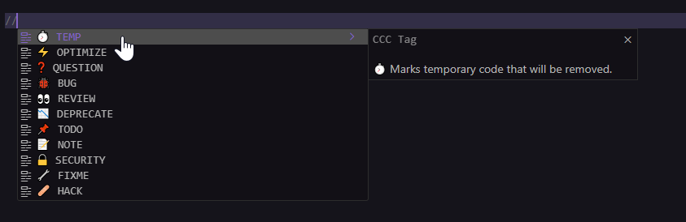

# 🏷️ Code Commenting Convention (CCC)

**CCC (Code Commenting Convention)** is a universal, structured way to write meaningful, standardized comments inside source code.  
Inspired by *Conventional Commits*, CCC is designed specifically **for developers working directly in code files**.

This repository includes:
- 📘 The official CCC specification  
- 🔌 The CCC VS Code extension (autocomplete + hover)  
- 🧩 Multi-language examples  

---

## ✨ Why CCC?

Traditional comments are often inconsistent and unclear:  
`// fix this`, `# needs improvement`, `# quick hack?`

CCC solves this by providing:
- **Consistency** → Same tags across all languages  
- **Visual scanning** → Each tag has an emoji  
- **Clear intention** → Each comment communicates purpose  
- **Editor tooling** → VS Code support (other editors planned)

---

## 🏷️ Official CCC Tags

| Tag | Emoji | Meaning |
|-----|-------|---------|
| `TODO` | 📌 | Work that needs to be completed or fixed. |
| `FIXME` | 🔧 | Code that is broken or requires fixing. |
| `NOTE` | 📝 | Important contextual information. |
| `HACK` | 🩹 | Temporary workaround or quick fix. |
| `BUG` | 🐞 | Known bug in the code. |
| `OPTIMIZE` | ⚡ | Potential performance improvement. |
| `REVIEW` | 👀 | Requires peer review from another developer. |
| `QUESTION` | ❓ | Uncertainty or a question about the code. |
| `TEMP` | ⏱️ | Temporary code to be removed later. |
| `SECURITY` | 🔒 | Security-critical code. |
| `DEPRECATE` | 📉 | Code that is outdated and should be removed. |

---

## 🧩 Examples in Different Languages

### JavaScript
```js
// TODO: Add validation for user input 📌
```

### Python
```py
# HACK: This is a quick fix for bug #123 🩹
```
###VSCode Extension

[Install Here](https://marketplace.visualstudio.com/items?itemName=Chrisiisx.code-commenting-convention)

