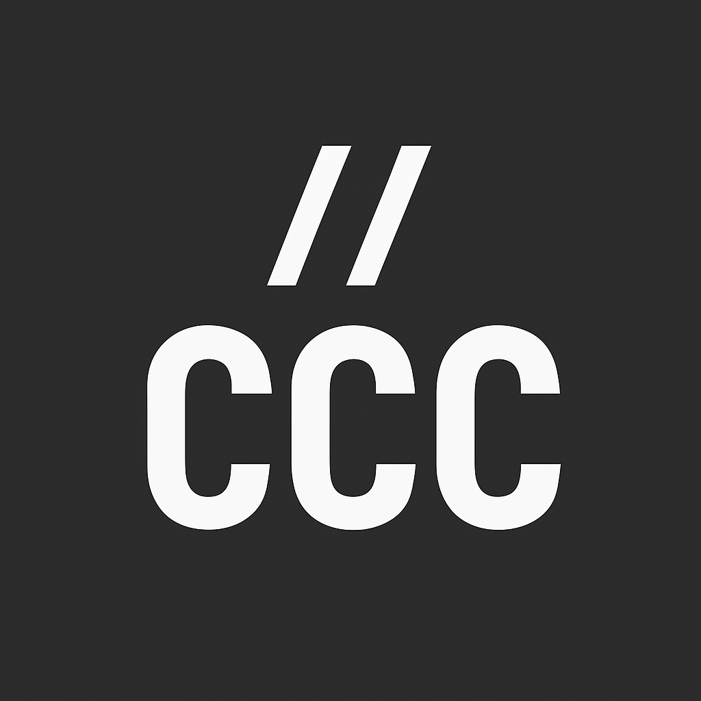

# Code Commenting Convention (CCC)

**CCC (Code Commenting Convention)** is a lightweight VS Code extension that helps developers write **clear, structured, and consistent comments** in their code.  
Inspired by *Conventional Commits*, CCC standardizes comment tags with **emoji support** and works across **all programming languages**.

---

## ✨ Features

### 🔹 Smart Autocompletion
CCC automatically suggests comment tags as you type comment characters like:
// /* -- ; % <!--

All supported CCC tags appear instantly, just like VS Code keywords.

### 🔹 Hover Descriptions
Hover over a tag (e.g., `TODO`, `FIXME`, `SECURITY`) to see its **meaning and emoji**.

### 🔹 Universal Language Support
Works in **JavaScript, Python, Java, C#, Go, SQL, HTML, Bash, Ruby, and more**.

### 🔹 Zero Configuration
Install and start using it immediately — no setup required.

---

## 🏷️ Official CCC Tags

| Tag | Emoji | Meaning |
|-----|-------|---------|
| `TODO` | 📌 | Work that needs to be completed or fixed. |
| `FIXME` | 🔧 | Code that is broken or requires fixing. |
| `NOTE` | 📝 | Important contextual information. |
| `HACK` | 🩹 | Temporary workaround or quick fix. |
| `BUG` | 🐞 | Known bug in the code. |
| `OPTIMIZE` | ⚡ | Potential performance improvement. |
| `REVIEW` | 👀 | Requires peer review from another developer. |
| `QUESTION` | ❓ | Uncertainty or a question about the code. |
| `TEMP` | ⏱️ | Temporary code to be removed later. |
| `SECURITY` | 🔒 | Security-critical code. |
| `DEPRECATE` | 📉 | Code that is outdated and should be removed. |

---

## 🧩 Examples

### JavaScript
```js
// TODO: Add validation for user input 📌
```
### Python
```py
// #HACK: This is a quick fix for bug #123 🩹
```


### 🤝 Contributing

Contributions are welcome! You can help by:

-Proposing new tags

-Improving descriptions

-Adding examples for more languages

-Creating integrations for other editors (JetBrains, Neovim, Sublime, etc.)

-Reporting bugs or suggesting features




